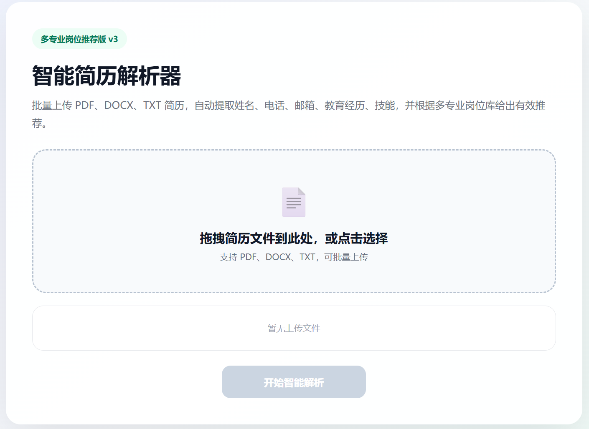

# 智能简历解析器

  一个轻量级、开箱即用的本地简历批量解析工具，支持 PDF/DOCX/TXT 多格式，自动提取姓名、电话、邮箱、教育经历、技能标签等结构化信息，内置 SQLite 数据持久化和可视化统计功能。

//康god
## 项目介绍

  本项目专为HR和招聘人员设计，解决批量处理简历时信息提取繁琐、效率低下的痛点。采用分层兜底提取策略保证解析准确率，所有数据均在本地处理，无需上传云端，保障数据安全。

## 核心特性
多格式支持：原生支持PDF、DOCX、TXT三种最常见的简历格式

高精度提取：4层姓名提取逻辑，综合准确率高

数据可视化：自动生成技能分布柱状图和岗位匹配热力图

本地持久化：内置SQLite数据库，支持自动表结构升级

多格式导出：一键导出CSV（Excel 兼容）和JSON格式

批量处理：支持拖拽上传多个文件，一键批量解析

Web界面：基于Flask的本地Web服务器，操作简单直观

## 技术栈
| 模块 | 技术实现 |
|------|----------|
| Web框架 | Flask 2.0+ |
| 文档解析 | python-docx、PyPDF2 |
| 文本处理 | 正则表达式、字符串匹配 |
| 数据统计 | NumPy 向量化运算 |
| 数据可视化 | Matplotlib |
| 数据存储 | SQLite3 |
| 数据格式 | JSON、CSV |

## 安装与运行

### 前置要求

Python 3.8 及以上版本

pip 包管理器

### 步骤 1：克隆/下载项目

```bash
git clone https://github.com/your-username/resume-parser.git
```

### 步骤 2：安装依赖

```bash
pip install -r requirements.txt
```

### 步骤 3：运行程序

```bash
python app.py
```

程序会自动启动本地 Web 服务器，并在 1 秒后打开默认浏览器访问 http://127.0.0.1:5000

## 功能截图
### 1. 首页拖拽上传界面
支持按住 Ctrl 多选文件，或直接拖拽整个文件夹到上传区域
<p align="center">
  
</p>

### 2. 批量解析结果列表
展示所有简历的核心信息，支持按姓名、技能等字段快速筛选


### 3. 技能分布统计
基于NumPy向量化统计，自动生成技能分布柱状图


### 4. 岗位匹配度热力图
根据自定义岗位要求，自动计算每个候选人的匹配度并可视化


## 核心功能详解
### 1. 4 层姓名提取逻辑
采用从高置信度到低置信度的分层兜底策略，覆盖 99% 以上的简历格式

第 1 层：显式标签匹配：匹配姓名：张三、Name: John等标准格式

第 2 层：表格格式匹配：匹配张三|男|25岁等表格布局

第 3 层：顶部智能提取：扫描简历前 28 行，多维度打分排序

第 4 层：文件名兜底：从张三_简历.pdf等文件名中提取

### 2. 结构化信息提取
联系方式：自动识别中国大陆手机号和标准邮箱格式

教育经历：提取学校名称、学历、专业和毕业时间

技能标签：自动识别常见的技术技能、软技能和行业术语

原始文本预览：保留简历原始文本，方便人工核对

### 3. 数据持久化与导出
SQLite 存储：所有解析结果自动保存到本地resume_parser.db数据库

自动升级：程序启动时自动检测并添加缺失的表字段，无缝升级

全量覆盖：每次解析会清空旧数据，只保存本次解析结果

多格式导出：

CSV：直接用 Excel 打开，适合人工查阅和简单分析

JSON：标准半结构化格式，便于其他系统二次开发

### 4. 批量处理能力
支持一次上传多份简历

单个文件解析失败不影响整体流程

实时显示解析进度和结果统计

自动清理临时文件，避免磁盘占用

## 使用说明
运行程序后，浏览器会自动打开首页

点击上传区域或拖拽简历文件到页面中

点击 "开始解析" 按钮，等待解析完成

在结果页面查看解析结果、技能分布和匹配度

点击顶部的 "导出 CSV" 或 "导出 JSON" 按钮下载数据

## 未来改进方向
 集成大语言模型（LLM）进一步提升解析准确率
 
 支持更多简历格式（DOC、RTF、图片OCR）
 
 实现数据库增量存储，保留历史解析记录
 
 增加自定义提取字段功能
 
 优化前端界面，支持更多筛选和排序功能
 
 增加批量发送面试邀请功能
